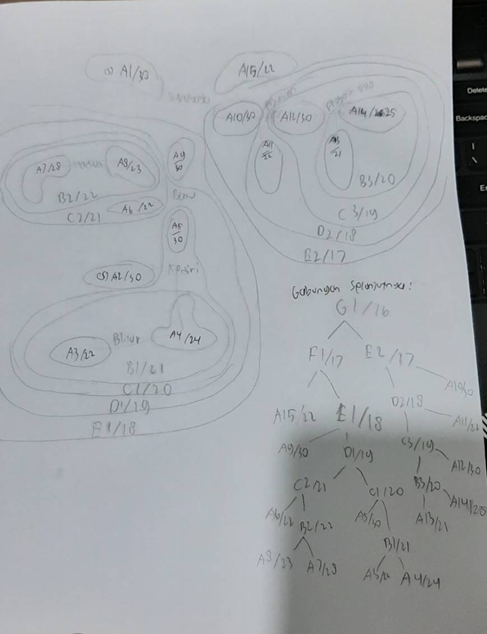
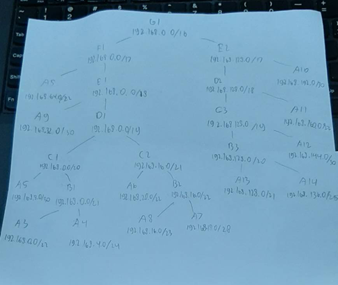
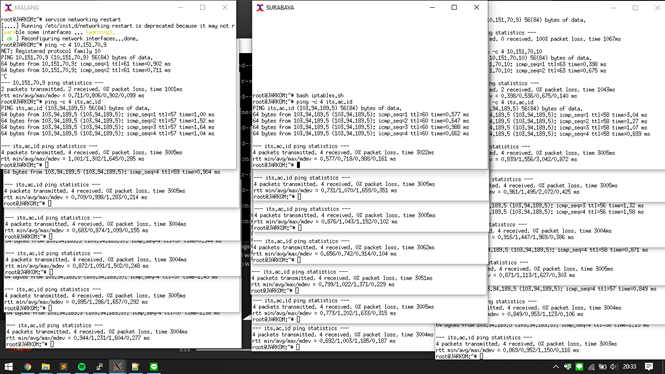
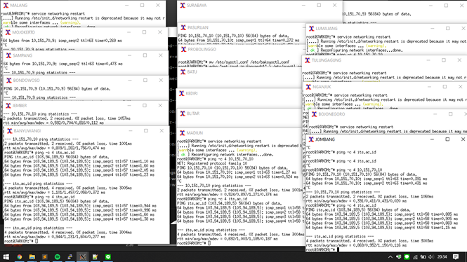
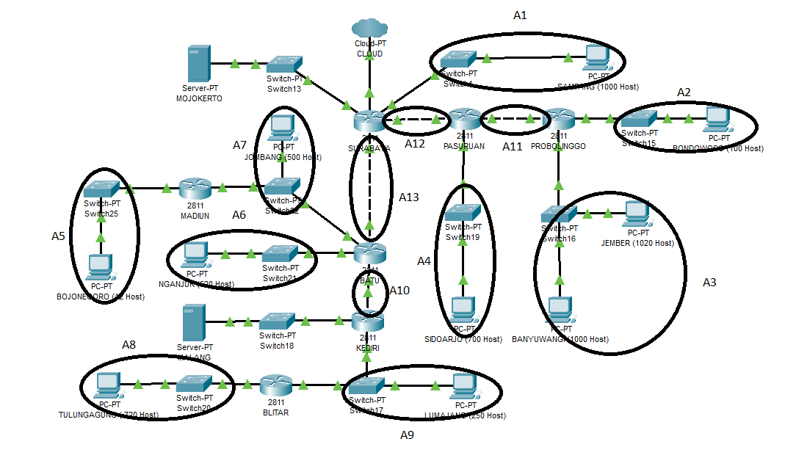
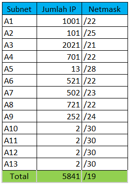
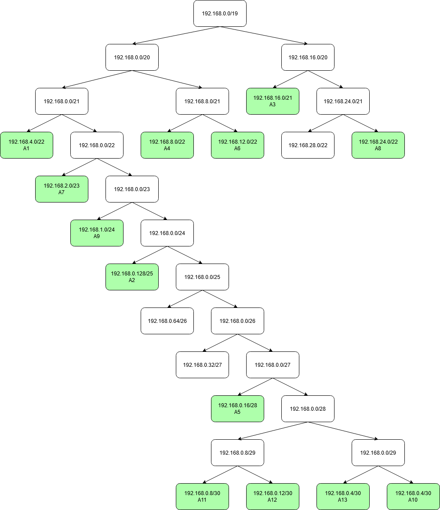
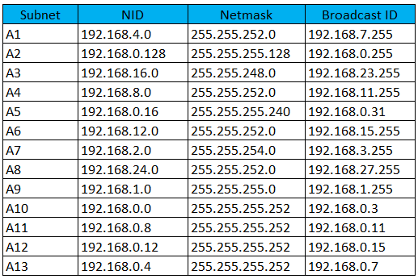
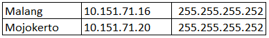
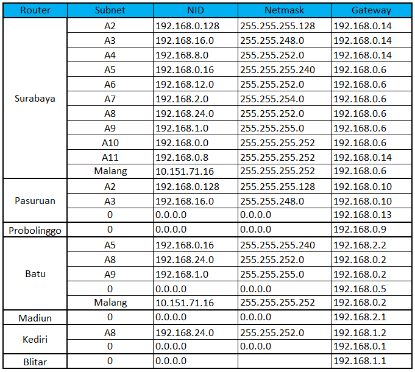

# Jarkom_Modul4_Lapres_E1
## UML CIDR
### Pembagian subnet

### Kebutuhan IP
**Server**
|Subnet|Jumlah IP|Netmask
|------|---------|-------
|A1|2|/30
|A2|2|/30

**Client**
|Subnet|Jumlah IP|Netmask
|------|---------|-------
|A3|721|/22
|A4|252|/24
|A5|2|/30
|A6|521|/22
|A7|13|/28
|A8|502|/23
|A9|2|/30
|A10|2|/30
|A11|701|/22
|A12|2|/30
|A13|2021|/21
|A14|101|/25
|A15|1001|/22
|Total|5841|/19

### Pembagian IP

### UML

## CPT VLSM
### Pembagian subnet

### Kebutuhan IP

### Tree

### Pembagian NID

### Routing

